# About me

- [My website](https://davidnorman.uk/)
- [My Twitter](https://twitter.com/davidn0rman/)
- [My LinkedIn](https://www.linkedin.com/in/davidn0rman/)
- [My bed](https://www.ikea.com/gb/en/p/malm-ottoman-bed-black-brown-50404819/)

## Personal website stats:

   

<!--
**davidn0rman/davidn0rman** is a ✨ _special_ ✨ repository because its `README.md` (this file) appears on your GitHub profile.

Here are some ideas to get you started:

- 🔭 I’m currently working on ...
- 🌱 I’m currently learning ...
- 👯 I’m looking to collaborate on ...
- 🤔 I’m looking for help with ...
- 💬 Ask me about ...
- 📫 How to reach me: ...
- 😄 Pronouns: ...
- ⚡ Fun fact: ...
-->
